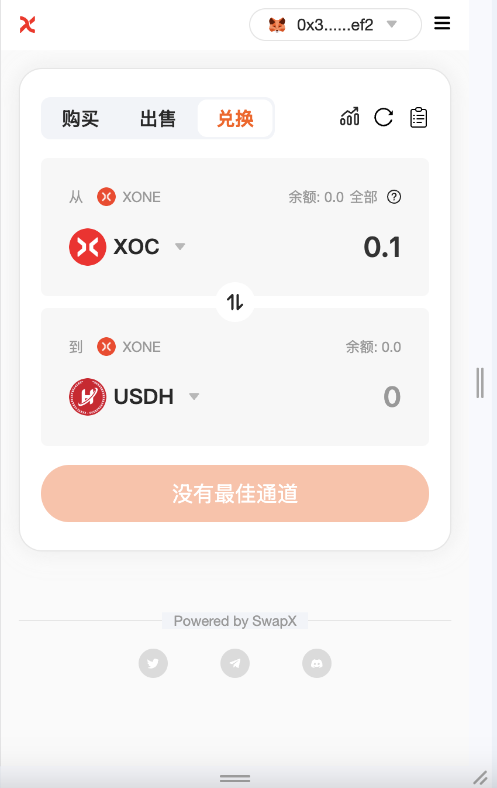

# 代币兑换
[英语](trade.EN.md) | [中文](trade.md)

去中心化交易所（DEX）的代币兑换是通过区块链智能合约实现的点对点资产交换，其核心特征和流程如下：
## 非托管机制：
    * 用户始终通过钱包（如MetaMask）掌控私钥
    * 资产无需存入交易所，直接由智能合约完成链上结算
## 兑换实现方式：
    【AMM模式】
    基于流动性池（如Uniswap的x*y=k算法）
    价格由资金池比例自动计算
    兑换公式：Δy = (Δx * y)/(x + Δx)
    【订单簿模式】
    链上订单撮合（如dYdX）
    买卖挂单上链执行

SwapX 上的 [**代币兑换**](https://swapx.exchange) 是一种简单的代币兑换方式，流动性来自于 SwapX 上创建的流动性池（https://swapx.exchange/pools）。

# 费用
当您在SwapX交易所进行代币兑换（交易）时，您将根据交易所经过的流动性池类型支付交易费。
## 流动性提供者费用
兑换代币需支付0.3% 的费用。该费用由流动性提供者根据其对流动性储备的贡献按比例分配。
交换费用会立即存入流动性储备。这会增加流动性代币的价值，作为对所有流动性提供者的支付，其金额与他们在池中的份额成比例。费用是通过销毁流动性代币来收取的，以消除基础储备的比例份额。
## 协议费用
目前没有协议费用。但是，将来可能会收取0.05% 的费用。
将来，协议范围内每笔交易收取0.05% 的费用可能会生效。这相当于0.30% 费用的⅙ 分之一(16.6̅%)。如果feeTo 不为address(0)( 0x0000000000000000000000000000000000000000)，则该费用有效，表明feeTo 是费用的接收者。
该金额不会影响交易者支付的费用，但会影响流动性提供者收到的金额。

